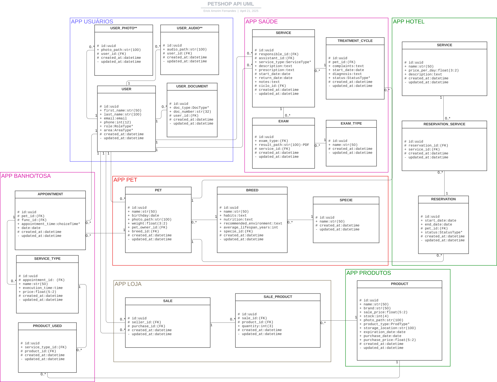

# APIPetShop

## Introdução:
<p align="justify"> 
Recentemente, decidi aplicar os conhecimentos que adquiri ao longo de dois anos de trabalho e, ao mesmo tempo, utilizar este projeto para estudar novas ferramentas, criando algo para meu portfólio. Para isso, imaginei uma situação do mundo real e desenvolvi uma solução. Assim, surgiu a ideia de criar uma API para um petshop.
</p>

<p align="justify"> 
O projeto abrange as principais funções relacionadas a pets, reunidas em um único serviço: banho e tosa, atendimento veterinário, venda de produtos pet e hotel para pets.
</p>

<p align="justify"> 
Após definir o escopo do projeto, escolhi as tecnologias que utilizaria, conforme ilustrado na Figura 1 abaixo. A proposta é que este sistema funcione como um ambiente de desenvolvimento completo, encapsulado em um Docker-compose, para facilitar o download, as melhorias e os testes.
</p>


<p align="center"> 
figura 1 - Modelo completo
</p>

## Especificações:

* Keycloak: 
<p align="justify"> 
- O Keycloak é uma excelente ferramenta de autenticação e autorização, oferecendo diversos recursos nessa área. Neste projeto, sua principal função será gerenciar a autenticação e autorização dos serviços, além de aproveitar funcionalidades relacionadas a usuários, como envio de e-mails, autenticação em dois fatores e controle de contas.
</p>

* FakeSMTP: 
<p align="justify"> 
- Como este é um ambiente de desenvolvimento, optei por usar o FakeSMTP para simular as funções que dependem de e-mail. Ele será um auxiliar nos testes, mas, em um ambiente de produção, poderá ser facilmente substituído por um serviço de SMTP da empresa.
</p>

* PostgreSQL (PSQL): 
<p align="justify"> 
- Será o banco de dados principal do sistema.
</p>

* MinIO: 
<p align="justify"> 
- Funcionará como o bucket de armazenamento para imagens, documentos e outros dados importantes.
</p>

* PetshopAPI: 
<p align="justify"> 
- Este será o núcleo do projeto. Todas as aplicações definidas estarão concentradas aqui, sendo responsável pelas rotas REST, utilizando o Django REST Framework (DRF).
</p>

* Kong: 
<p align="justify"> 
- O Kong é uma ferramenta que ainda estou explorando, sendo um dos motivos pelos quais iniciei este projeto. A ideia é que ele funcione como um API Gateway, unificando o projeto e gerenciando a comunicação entre os serviços. No entanto, como ainda não tenho familiaridade suficiente, decidi simplificar o modelo original (Figura 1) para o apresentado na Figura 2, removendo o Kong temporariamente. Assim, posso concluir o projeto com as habilidades que já possuo e, posteriormente, estudar e implementar o Kong.
</p>

<p align="justify"> 
Essa alteração foi feita por praticidade, sem impactos negativos no desenvolvimento. Além disso, me permitirá explorar práticas como o uso de branches e testar o squash commit, outra técnica que tenho interesse em aplicar.
</p>


<p align="center"> 
figura 2 - Modelo simplificado
</p>

## Detalhamento
<p align="justify">
Definido como o projeto será iniciado, vou detalhar algumas funções e particularidades dos serviços "PetshopAPI" e "Bot de Preços".
</p> 

* Bot de Preços:

<p align="justify">
O funcionamento do bot ainda não está completamente definido, mas a ideia básica é que ele será desenvolvido como um serviço em Flask juntamente com o BeautifulSoup. Ele terá uma rota REST onde o usuário, que precisa estar autenticado e autorizado, enviará as especificações e detalhes do que deseja buscar em formato JSON. O bot processará essas informações, executará a busca e gerará uma planilha Excel com os dados coletados.
</p>

<p align="justify">
Essas informações serão armazenadas no bucket MinIO e/ou enviadas por e-mail ao usuário quando prontas. Alternativamente, o bot poderá enviar um link para download ou o próprio arquivo diretamente. Ainda preciso definir melhor alguns detalhes, mas essa é a ideia geral de como o bot deverá funcionar.
</p> 

* PetshopAPI:

<p align="justify">
Como mencionado anteriormente, o PetshopAPI será uma API desenvolvida utilizando o Django REST Framework (DRF), que centralizará as principais funcionalidades que um petshop poderia necessitar. Durante a modelagem do projeto, optei por um design modular, visando a fácil integração e desacoplamento de funcionalidades. Para isso, o sistema será dividido em sete aplicações, cada uma focada em um aspecto específico do negócio:
</p>

1. APP Usuários: 
<p align="justify">
- Gerencia toda a parte relacionada aos usuários do sistema, como registro, autenticação e controle de permissões.
</p> 

2. APP Saúde: 
<p align="justify">
- Focada no atendimento médico dos pets, incluindo exames, consultas, cirurgias e tratamentos.
</p> 

3. APP Pet: 
<p align="justify">
- Responsável por armazenar e gerenciar informações sobre os pets, como tutor, características e perfil.
</p> 

4. APP Banho/Tosa: 
<p align="justify">
- Cuida da parte de serviços de banho e tosa, com gestão de agendamentos e execução desses serviços.

5. APP Hotel: 
<p align="justify">
- Garante o controle da hospedagem de pets, incluindo disponibilidade de quartos, reservas e check-ins.
</p> 

6. APP Loja: 
<p align="justify">
- Gerencia o estoque e a venda de produtos pet, abrangendo desde o cadastro de produtos até a conclusão das vendas.
</p> 

7. APP Produtos: 
<p align="justify">
- Centraliza as informações dos produtos vendidos ou utilizados nos serviços, funcionando como um banco de dados compartilhado entre as outras aplicações.
</p> 


<p align="center"> 
figura 3 - Diagrama UML
</p> 

<p align="justify">
Você pode estar se perguntando por que existe uma aplicação dedicada apenas para os produtos. A razão é que, para garantir a modularidade e a flexibilidade do sistema, as aplicações que compartilham serviços comuns, como Banho/Tosa e Loja, precisam de um intermediário central. Ao separar os dados dos produtos em uma aplicação própria, é possível integrar diferentes serviços que utilizam essas mesmas informações, evitando redundâncias e facilitando a manutenção.
</p> 

<p align="justify">
Se observar o diagrama UML na Figura 3, verá que tanto a aplicação de Banho/Tosa quanto a de Loja utilizam as mesmas informações sobre produtos. Isso justifica a necessidade de uma aplicação separada para produtos, permitindo que, por exemplo, uma clínica veterinária que não ofereça serviços de banho e tosa ainda possa utilizar o sistema sem complicações. Nesse caso, bastaria não incluir a APP Banho/Tosa na implementação, e o restante do sistema continuaria funcionando normalmente.
</p> 

<p align="justify">
Esse design também facilita a personalização e expansão do sistema. Um petshop que não ofereça um serviço específico, como saúde ou hospedagem, pode adquirir apenas os módulos necessários. Se futuramente decidir expandir seus serviços, basta adicionar os módulos correspondentes sem necessidade de grandes adaptações ou retrabalho. Essa flexibilidade oferece uma solução prática tanto para o presente quanto para futuras expansões do negócio.
</p> 

<p align="justify">
Para concluir a análise do diagrama UML apresentado na Figura 3, vou comentar algumas definições importantes adotadas neste projeto. Utilizei os caracteres #, + e - para definir o tipo de acesso aos dados, sendo:
</p> 

#: Variáveis privadas que, após serem modificadas, não podem ser alteradas novamente.

+: Variáveis públicas, que podem ser alteradas a qualquer momento.

-: Informações restritas, que só podem ser modificadas por métodos internos ou agentes específicos.

<p align="justify">
Se você observar o UML, notará que algumas variáveis possuem um *. Esse asterisco indica que as opções para essas variáveis serão uma lista pré-definida, permitindo ao usuário apenas selecionar valores dentre os já estabelecidos. Adotei essa abordagem para garantir maior consistência nos dados, evitando duplicidades ou erros de digitação. Todas as variáveis com * são relativamente estáveis e não exigem mudanças frequentes, então definir listas prévias não será um problema. No entanto, caso seja necessário, essas listas poderão ser transformadas em tabelas editáveis, permitindo aos usuários adicionar ou remover valores. Inicialmente, optei por essa abordagem mais rígida por considerar que ela é suficiente para o contexto. 
</p> 

<p align="justify">
A única exceção a essa regra será no app de pet shop, pois a quantidade de espécies e raças de animais atendidos pode ser extensa. Tentando criar uma lista pré-definida, correria-se o risco de omitir muitas opções importantes. Por isso, adotei uma abordagem mais flexível, criando tabelas editáveis. Dessa forma, é possível começar com uma base inicial e, ao longo do tempo, os usuários podem complementar e expandir as informações conforme necessário, garantindo mais precisão e abrangência.
</p> 

<p align="justify">
Outro ponto importante é que a APP Usuários contém tabelas relacionadas a fotos e áudios dos usuários. Esses dados serão utilizados futuramente para implementar funcionalidades de acesso por reconhecimento de voz e imagem. No entanto, essa parte será desenvolvida somente após a conclusão do sistema completo, incluindo a integração com o Kong. Quando chegar a essa etapa, bem como em outras melhorias futuras, descreverei detalhadamente o que foi feito e como. Já adicionei esse modelo ao banco de dados para evitar a necessidade de modificar o diagrama UML posteriormente.
</p> 

<p align="justify">
Em relação à autenticação e autorização, será utilizado o Keycloak para gerenciar as credenciais dos usuários de maneira eficiente e segura. Quando um usuário é criado, ele é registrado tanto no Keycloak quanto no banco de dados próprio do projeto. No Keycloak, são armazenadas apenas informações básicas, como nome, e-mail e funções (roles). Todas as demais informações relacionadas ao usuário são armazenadas no banco de dados da API, garantindo uma separação clara entre os dados de autenticação e os dados específicos da aplicação.
</p> 

<p align="justify">
Uma outra melhoria planejada é a integração da API com o Llama 3 no LMStudio para gerar textos automaticamente com IA. A ideia é criar uma rota com um prompt predefinido, onde o usuário insere apenas informações-chave. Assim, os dados sobre as características de cada raça serão gerados automaticamente, permitindo o preenchimento dessas informações de forma mais rápida e eficiente. Se a resposta da IA não for satisfatória, o administrador poderá ajustá-la manualmente para garantir a qualidade das informações. Além disso, outra funcionalidade será oferecer ao usuário comum a possibilidade de acessar informações e dicas relacionadas ao seu pet, tornando a experiência mais personalizada e acolhedora.
</p> 

## TO DO:
<p align="justify">
Como mencionei anteriormente, este projeto de portfólio será utilizado para explorar e estudar novas ferramentas. Por esse motivo, ele será constantemente aprimorado e receberá novas funcionalidades com frequência. Para manter a organização do desenvolvimento, adotarei um TO DO separado em algumas categorias categorias: Tarefas concluidas, Tarefas em execução, Backlog e Upgrades.
</p> 

<p align="justify">
Esse TO DO funcionará como uma versão simplificada de sprint e backlog. Como estou desenvolvendo este projeto de forma independente e não pretendo utilizar ferramentas de SCRUM, optei por essa abordagem prática para garantir a organização e não perder de vista as ideias que surgirem ao longo do processo.
</p> 

### Tarefas concluídas:
- [x] Modelar serviços do projeto
- [x] Modelar banco de dados
- [x] Criar o readme
- [x] Inicializar projeto DJANGO da API
- [x] Criar o docker-compose do projeto geral e Dockerfile do serviço DRF.
- [x] Criar json com configurações iniciais do keycloak
- [x] Criar .env e envexample.txt
- [x] Criar configuração do minIO
- [x] Função upload_file minIO
- [x] Configurações iniciais do projeto DRF
- [x] Criar validação de imagem
- [x] Implementar os modelos de banco de dados no projeto
- [x] Implementar os serializers
- [x] Implementar as views - básicas, sem a personalização de rotas ainda (CRUD - padrão do DJANGO)
- [x] Adiconar o swagger
- [x] Criar função para mudar o nome do arquivo salvo no banco para um uuid
- [x] Função delete_file minIO + view delete em produtos
- [x] Função update_file minIO + view update em produtos
- [x] Implementar autenticação e autorização com o keycloak
- [x] Implementar o django-filter em list de produtos
- [x] Bug: Na view de produtos existia a possibilidade de a imagem ser salva sem o produto ser salvo no banco
- [x] Arquivo de roles devidamente configurado
- [x] Aplicar regras de autenticação e autorização geral em todas as views
- [x] Personalização das rotas da app produtos
- [x] Adicionar descrição das funções criadas em utils, bucket, keycloak etc
- [x] Criação de regras no models de usuarios para não deixar roles e áreas sem relação se misturarem
- [x] Bug o username do keycloak é imutável, então não posso utilizar o email pra isso
- [x] Criar funções de chamada para o Keycloak para facilitar manutenção
- [x] Adicionar ID do Keycloak ao modelo User para evitar inconsistências
- [x] Bug *
- [x] Implementar logging para facilitar manutenção em novas aplicações
- [x] Aprimorar tratamento de exceções no cliente Keycloak e nas views de usuários(utils: validations, functions. produtos:views. keycloak_config: auth, permissio. bucket:minio_client, usuarios:views)
- [x] Personalização nas rotas da app usuarios
- [x] Padronizar rotas de produtos com nova regra
- [x] Adicionar filtros aos lists dos modelos de usuários
- [x] Exclusão simultânea de dados relacionados ao usuários tanto no django quanto no bucket
- [x] Obrigar a criação de usuário na view com um documento
- [x] Permitir a exclusão de documento apenas se o usuário tiver mais de um cadastrado, se não só será excluido se o usuário também for
- [x] Validação de documento único (não pode haver valores de documento repetido para um mesmo tipo de documento)
- [x] Personalização das rotas da app pet
- [x] Modificar os filtros das rotas list(que possua filtro) em app_pet para filtrar por nome e não pelo id
- [x] Personalização das rotas da app loja

    (*) Pelo fato de eu usar um uuid diferente para o user salvo no keycloak e o user salvo no django eu preciso fazer uma consulta com o get (app usuarios - User) para recuperar esses valores e depois verificar se quem solicitou possui acesso ou não. No momento não é um problema, mas em uma aplicação maior pode gerar problemas de desempenho e risco de segurança. Para consertar isso eu posso adicionar o uuid do django nas informações do jwt token do keycloak. Outra solução seria estrutual, por exemplo, usar o mesmo uuid de usuário no keycloak e no django. Entretanto, esta seria uma solução mais trabalhosa. Etapas para correção do bug:
    - [x] Descobrir como configurar esse novos atributos(?) no keycloak
    - [x] Verificar como fazer esta configuração no json de criação do keycloak - para ficar automatizado. OBS, não ficou 100% automatizado, mas ficou bem simplificado utilizando o postman + interface keycloak
    - [x] Modificar a views para salvar o valor quando criar o usuário
    - [x] Modificar como a verificação é feita nas outras views.

### Tarefas em execução:
- [ ] Personalização das rotas da app hotel

### Backlog:
- [ ] Criar uma personalização no list de pet para que se o token utilizado for de um médico mostrar apenas que sejam seus pacientes - Tarefa bonus
- [ ] Personalização das rotas da app banhotosa
- [ ] Personalização das rotas da app saude
- [ ] Aplicar filtros nos lists das outras views

### Upgrades:
Em upgrades vou separar tarefas grande que precisarão ser dividas em outras subtarefas.
- [ ] criação de testes unitários com pytest
- [ ] Criação do bot
- [ ] Adicionar o Kong ao projeto
- [ ] Criar um sistema que irá preencher caracteristicas (hábitos, alimentação, etc) das raças dos pets usando o llama3 com o lmstudio, detalhes pensar futuramente.
- [ ] Criar uma aplicação extra completa (front e back) com um serviço de chat por texto e voz.

### IMPORTANTE:
<p align="justify">
Para facilitar a organização e testar o uso de squash commits, o projeto seguirá a estrutura de branches descrita abaixo. A branch main será onde a versão mais recente e estável do projeto será mergeada e ficará disponível publicamente no GitHub.
</p> 

<p align="justify">
No entanto, cada atualização ou melhoria será feita em branches separadas, permitindo manter um histórico das versões anteriores. Se você deseja testar uma versão estável, use a branch main ou uma branch já concluida. Para executar melhorias em andamento ou acessar uma versão anterior estável, será necessário selecionar a branch correspondente. Abaixo estão as branches disponíveis e suas descrições:
</p> 

<p align="justify">
Além disso, observe que usei, na maioria das views, o BaseViewSet (que é basicamente uma ModelViewSet do django). No entanto, essa pode não ser a melhor prática. Caso você decida utilizá-lo, certifique-se de que todas as rotas disponibilizadas estão funcionando conforme o planejado. Se não estiverem, considere o uso de mixins para garantir a disponibilidade apenas das rotas que você escolher. Eu estou usando o ModelViewSet porque este é um ambiente de testes e desenvolvimento para mim; em produção, é importante estar atento a esse detalhe.
</p> 

#### Branchs:
- main: No momento possui apenas arquivos básicos e o readme sem nenhuma configuração
- apisimplificada: Onde estou desenvolvendo o projeto simplificado da figura 2.

### Executando o projeto:
Para testar e executar o projeto em sua máquina local, siga o passo a passo abaixo:

```
Código explicativo aqui:
faça o clone deste repositório
selecione a branch que deseja executar
...
```

Quando pronto colocar um vídeo demonstrativo

Além disso pretendo adicionar algumas documentações do projeto, como o link das rotas testadas pelo postman assim como o swagger

Na parte de grupos vou definir a seguinte logica:

Cada role do keycloak recebe a função do usuário e os filtros das tabelas são feitos de acordo com essas roles. Na parte de grupos do keycloak eu criei de modelo para um atentente que seja responsável por todos os setores e outro grupo para alguns setores, está de exemplo mas neste projeto os grupos não serão muito utilizados. Outro ponto importante será a regra a ser seguida: Informações relacionadas à vendas ou informativas serão públicas, por exemplo serviços oferecidos em geral(excluido médicos, pois exames ou tarefas médicas precisam passar por avaliação de um veterinario antes) e informações bonus como as contidas em breed e specie e product(só que neste caso alguns campos devem ser filtrados como preço de compra, photo_path e storage_location). Em user a logica é um pouco diferente, o superuser terá acesso a todos os recursos, o estagiários aos gets, mas na criação cada usuário só poderá modificar seus próprios dados. No geral os lists terão acesso publico mas limitado, ou seja, se fazer sentido o usuário terá acesso à aqueles dados que se relacionam de alguma forma com ele, e superusuarios ou outras funções definidas terão acesso total à todos os dados daquela tabela, se o token do usuario não tiver nenhum dado relacionado a lista retorada será vazia, e se por um acaso um usuario comum tentar acessar algum id que não seja relacionado ao dele uma mensagem de permissão negada será retornada

OBS.: É MUITO IMPORTANTE FALAR NO README SOBRE AS BRANCHS, POIS NÃO VOU TRABALHAR NA MAIN POR ENQUANTO ENTÃO ELA VAI FICAR DESATUALIZADA E É A QUE APARECE NO GITHUB, MUDAR A PADRÃO NÃO COMPENSA POR ENQUANTO, ENTÃO É MELHOR ESCREVER ATÉ QUE A PRIMEIRA PARTE DO PROJETO ESTEJA PRONTA!!!!!!!!!


ANOTAÇÕES:
- verificar seta para o bot(vai depender de como vou salvar os arquivos no minIO)
- Seria interessante verificar na hora de adicionar serviços no appointment verificar se o produto para aquele produto possui estoque, se não retornar um erro.
- as funções para lidar com o tempo no agendamento estão pronta e estão em functions e validations da app utils, quando for fazer a views lembrar de usar.
- não quero deixar esse monte de migrations, pois foram ajustes e não melhorias, depois limpar no arquivo final e deixar uma única.
- criar alguns dados para serem gerados junto com o docker-compose up, vai servir para facilitar se alguma pessoa quiser testar o projeto. As que devem receber estes valores são:

saude: exam_type
pet: breed, specie
banho/tosa: product_used, service_type
hotel: service
produtos: product

RESUMAO: log exception escreve o log sem fazer nada, usar quando quer acrescentar um extra do erro no log

handle exception faz o log do erro e levanta a exceção, pra não quebrar deve ser chamado dentro de um try

manage exception contem uma lista de responses para tipos predefindos de exception, você chama no except de uma resposta de requisição http, que ele irá tratar o erro que recebeu.

se quiser uma resposta personalizada do erro, você precisa carregar o return até a função da requisição http e  retornar la a resposta.


### Melhorias que um dia podem ser feitas (não prioritárias)
- no app saúde verificar se o responsivel de um serviço é válido, por exemplo, um zelador não pode ser o resnponsável por uma cirurgia, então quando for criado o dado deve-se verificar isso
- automatizar o tetment_cycle status de acordo com o serviço, por exemplo, uma vacina é aplicada e o ciclo já é finalizado????????? faz sentido?
- Nas apps com muitas tabelas, criar uma rota com um resumo de informações para usuários comuns, fazer uma coleção de dados relacionado ao usuário e  retornar tudo de uma vez. Opção para escolher as informações entre um pet especifico ou de um usuário. É só criar um filtro com nome ou id do pet.
- ver se consigo obrigar que o usuário só seja criado se um documento for adicionado junto, mesmo sendo tabelas separadas, tem a operação atomica (não serve pra isso), mas queria fazer no próprio models.
- Fazer validação de formato com o regex nos outros documentos
- Existem os Triggers em SQL para validações mais complexas, mas não vejo necessiadade de usar nesse projeto. É uma ação que daria mais segurança aos dados, mas pra um projeto de treino seria exagerado, futuramente posso fazer em alguma tabela para referencia.
- Apesar de muitas rotas públicas, todas elas precisam de um token válido, ou seja, gerado pelo keycloak e que passe pela instrospecção. Se em algum momento precisar mudar isso para não exigir token é só mudar a regra de como o django verifica o token.
- Implementar logs específicos para quando HasRolePermission permite ou nega acesso, e para quando KeyCloakAuthentication falha, pode ser útil para auditorias e para detectar possíveis tentativas de acesso não autorizado.
- Caso queria criar senhas mais robusta é possivel ir na adminstração do keycloak, authentication e por fim policies e escolher as regras que deseja para a senha de usuário.
- Criar uma branch demonstrando em alguma tabela como implementar o softdelete

### Observações
- O user foi modificado para salvar o id do usuário no keycloak, pois pode acontecer de inconsistencia nos dados, então para prevenir e deixar mais facil algum suporte vai ser necessário ter o id do user no keycloak sendo salvo
- Foi melhor criar funções que chamam o keycloak ao inves de usar o keycloak diretamente, pois em caso de troca do serviço do keycloak por outro basta modificar a função ao inves de sair procurando em todo o código onde elas foram chamadas
- Eu não criei regras de validação para a senha pelo fato de o keycloak ter opções personalizaveis para isso. Sendo dessa forma vou deixar como algo personalizável no projeto. Para saber como fazer esta configuração confira este vídeo tutorial: 

[colocar url do video aqui, diferentemente do de configuração apenas o links sem o video]

- Uma solução para prevenir erros na exclusão de arquivos foi utilizar o transaction.atomic deletando o user(ou o campo do django primeiro) e depois o objeto no minio, desta forma, se o user.delete() falhar o atomic volta os dados para a sua forma original do django e não acessa a parte de excluir os arquivos no minio. O que garante que se a imagem so será excluida se a informação não existir mais no banco do django. Além disso adicionei algumas mensagens de erros de exclusao no minio no log, pois assim, se necessaŕio, pode-se fazer uma varredura no log e uma limpeza de arquivos inuteis pode ser feita sem maiores problemas.

### HardDelete vs SoftDelete
Uma boa prática em projetos comerciais é evitar a exclusão definitiva de registros no banco de dados. Para isso, utiliza-se frequentemente a exclusão lógica (soft delete), que adiciona campos ao modelo, como is_active (booleano) e/ou deleted_at (datetime). O campo is_active indica se o registro está ativo, enquanto deleted_at registra a data e hora da exclusão para fins de auditoria.

Para gerenciar soft delete com chaves estrangeiras, pode-se sobrescrever o método delete dos modelos. Ao chamar esse método, o campo is_active é definido como False, e o campo deleted_at recebe o valor atual com now(). Assim, é possível usar self.orders.update(deleted_at=now()) dentro do delete personalizado para que o soft delete afete todos os registros relacionados. No entanto, em projetos grandes, reescrever o método delete em cada modelo pode ser inconveniente. Uma solução é criar um modelo abstrato com essa lógica e herdar esse comportamento nos demais modelos, eliminando a repetição de código.

Embora o Django ofereça ferramentas como pre_delete e post_delete, ainda não explorei como aplicá-las e quais seriam seus usos mais adequados.

#### Motivos para Não Implementar Soft Delete Neste Projeto
Optei por não implementar soft delete neste projeto por se tratar de um projeto não comercial, onde a manutenção de registros históricos não é essencial. Além disso, isso me permitiu explorar alternativas para rollback de usuários em conjunto com o Keycloak. Se o soft delete estivesse implementado, bastaria desativar o usuário tanto no Django quanto no Keycloak, o que simplificaria a solução. No entanto, encarei isso como um desafio e decidi buscar uma abordagem que exigisse maior criatividade.

#### Como Implementar o Soft Delete Neste Projeto
Se fosse necessário implementar o soft delete, as alterações seriam as seguintes:

Modificação do Modelo Base:
Localizado em utils.models, o modelo base seria atualizado para incluir os campos deleted_at (datetime) e, opcionalmente, is_active (booleano). O campo deleted_at registraria o momento da exclusão. Um registro com deleted_at diferente de null seria considerado "excluído". O método delete também seria sobrescrito para atualizar esses campos em vez de remover o registro.

Atualização dos Querysets:
Os querysets padrão precisariam filtrar apenas os registros com is_active=True ou deleted_at=null. Dependendo da regra de negócio, seria possível criar diferentes categorias de acesso, permitindo ou restringindo a visualização de registros marcados como excluídos.

Rollbacks e Integração com Keycloak:
No Keycloak, seria utilizado o campo enabled para indicar a exclusão. Em vez de remover usuários, bastaria alterar o status para desativado. Isso simplificaria a lógica, evitando recriações desnecessárias de usuários durante rollbacks. Para restaurar um usuário, bastaria reativá-lo.

Gerenciamento de Dados no Bucket:
Dependendo da regra de negócio, os dados relacionados no bucket poderiam ser mantidos temporariamente. Uma solução genérica seria implementar um "agente de limpeza", que verificaria registros com deleted_at preenchido e, após um período configurado, removeria os dados tanto do banco quanto do bucket. Essa abordagem equilibraria a necessidade de auditoria com a prevenção de sobrecarga de dados inativos.

Regra para Restauração de Contas:
Ao restaurar contas excluídas, seriam consideradas três opções:

- Reativar o usuário com os dados existentes.
- Reativar o usuário atualizando seus dados.
- Criar um novo usuário, mantendo os dados antigos como excluídos (o que poderia causar conflitos com campos únicos, como CPF e nome de usuário, mas garantiria um histórico completo).

Para este projeto em particular, as duas primeiras opções seriam mais adequadas, já que evitam duplicidades e conflitos.


### Extra
<p align="justify">
Apenas para fins de anotações, vou deixar uma lista de tecnologias que desejo estudar, embora nem todas se encaixem necessariamente neste projeto. Mantendo essa lista aqui, servirá como um lembrete, uma vez que pretendo revisitar este projeto com certa frequência:
</p> 

- [ ] Kafka
- [ ] RabbitMQ
- [ ] Spark
- [ ] FastAPI


OBS.: Revisar os editable = false nos models, lembrando que ele apenas retira o campo do formulário e não que torna falso a edição do campo

Editar no postman os token de user, qnd eu reiniciar o docker. Criar uma pasta com todos os tipos de user no postman, para facilitar os testes com token
Mudar os digitos para o preço do hotel, pelo menos 4 digitos mais 2 decimais
A lógica que eu vou seguir é que os usuários podem ver muitas coisas mas em questão de vendas precisa passar na mão de um funcionário, pois não há um sistema de pagamento implementado, então precissa passar na mão de um funcionário...
Verificar a criação de breed se eu colocar vira lata em especies diferentes não é permitido, analisa se preciso verificar a combinação ao inves de apenas um campo
Outra melhoria futura é em relação ao tratamento de preços, é possível observar no uml da app banho/tosa foi feita uma correção para manter o histórico de preço dos
serviços, onde existe um preço para o serviço e outro para quando o serviço executado foi salvo, assim, se o preço do serviço for atualizado outros já feitos
terão um hitórico de preço correto. Sendo assim, seria necessaŕio fazer o mesmo nas outras apps. A situação não está errada, pois quando criei não considerei que os preços seriam atualizados, então nesse modelo estava correto, entretanto a opção de ter atualização é muito mais realista, portanto, vão ser tarefas adicionadas para melhorias futuras, pois o foco no momento é terminar a primeira versão.